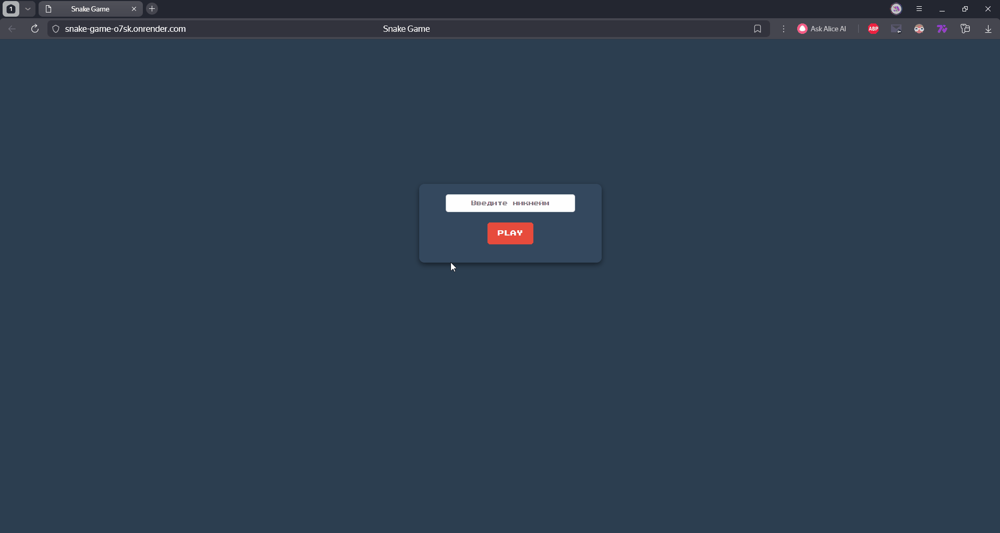

# Веб-приложение «Змейка» (Fullstack)
Учебный проект, выполненный в рамках производственной практики. Представляет собой классическую аркадную игру «Змейка» с клиент-серверной архитектурой, возможностью регистрации по никнейму и глобальной таблицей рекордов.

## 🎮 Демонстрация работы

---

## 🚀 Ссылки
* **Живой деплой игры (Render):** https://snake-game-o7sk.onrender.com

---

## 🛠 Стек технологий

* **Frontend:** HTML5 Canvas, CSS3, JavaScript (модель асинхронных запросов Fetch API / AJAX).
* **Backend:** Node.js, Express.js (маршрутизация, раздача статики, CORS-политика).
* **База данных:** PostgreSQL (реляционная СУБД в облаке Render).
* **Инструменты администрирования:** DBeaver (проектирование модели данных и экспорт ERD).
* **Качество кода:** Линтеры, интеграция со статическим анализатором Code Climate.

---

## 💡 Функциональные возможности

* **Авторизация сессии:** Игрок вводит уникальный никнейм перед началом игры. Сервер автоматически проверяет наличие пользователя в БД и создает новую запись при необходимости.
* **Игровой движок:** Динамический рендеринг змейки и генерация еды на Canvas, обработка коллизий (столкновение со стенами и собственным хвостом).
* **Персистентное сохранение:** Автоматическая отправка набранных очков на сервер сразу после экрана `Game Over`.
* **Рейтинг Лидеров (Топ-10):** Динамическая подгрузка и отображение лучших результатов игроков со всей базы данных в реальном времени.
